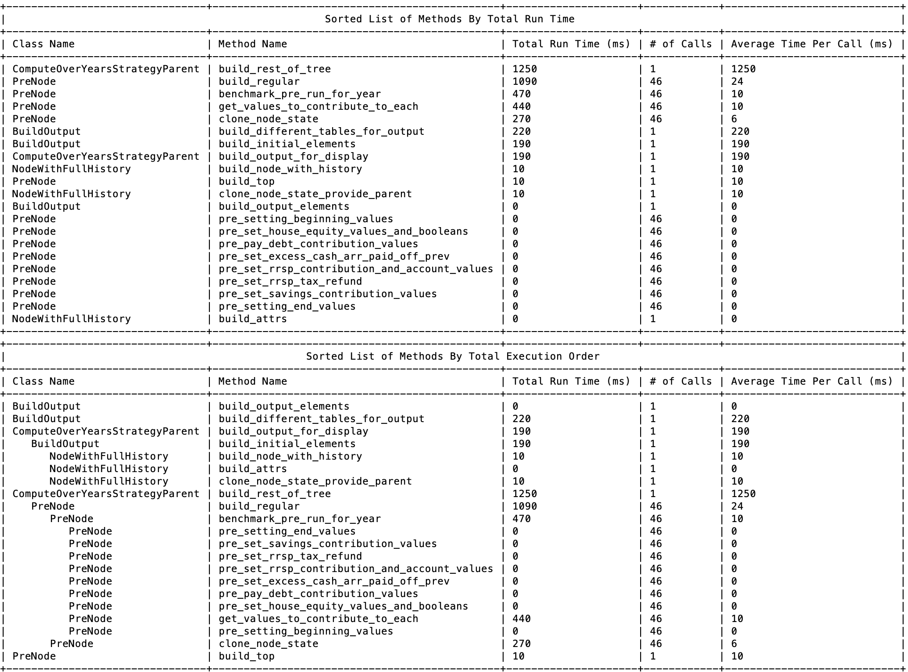

# TimeMethod


TimeMethod is a gem that makes it easy to see the run-time of different methods within Terminal


## Installation

Add this line to your application's Gemfile:

```ruby
gem 'time_method'
```

And then execute:

    $ bundle

Or install it yourself as:

    $ gem install time_method

## Usage


TimeMethod is built upon the excellent gem made here [here](https://github.com/Riskified/timeasure)

You can visit the above page for more details on usage. This version has some functionality trimmed down
and some functionality added. The focus is on development profiling of methods.

It outputs two tables at the end of a request/test being run. 

1) A list of methods sorted by total run time

2) A list of methods sorted by total execution order



In order to show these tables, call 
```StoreMeasurement.instance.print_all```
at the end of your request.

You can also create a middleware to do this.

## Development

After checking out the repo, run `bin/setup` to install dependencies. Then, run `rake spec` to run the tests. You can also run `bin/console` for an interactive prompt that will allow you to experiment.

To install this gem onto your local machine, run `bundle exec rake install`. To release a new version, update the version number in `version.rb`, and then run `bundle exec rake release`, which will create a git tag for the version, push git commits and tags, and push the `.gem` file to [rubygems.org](https://rubygems.org).

